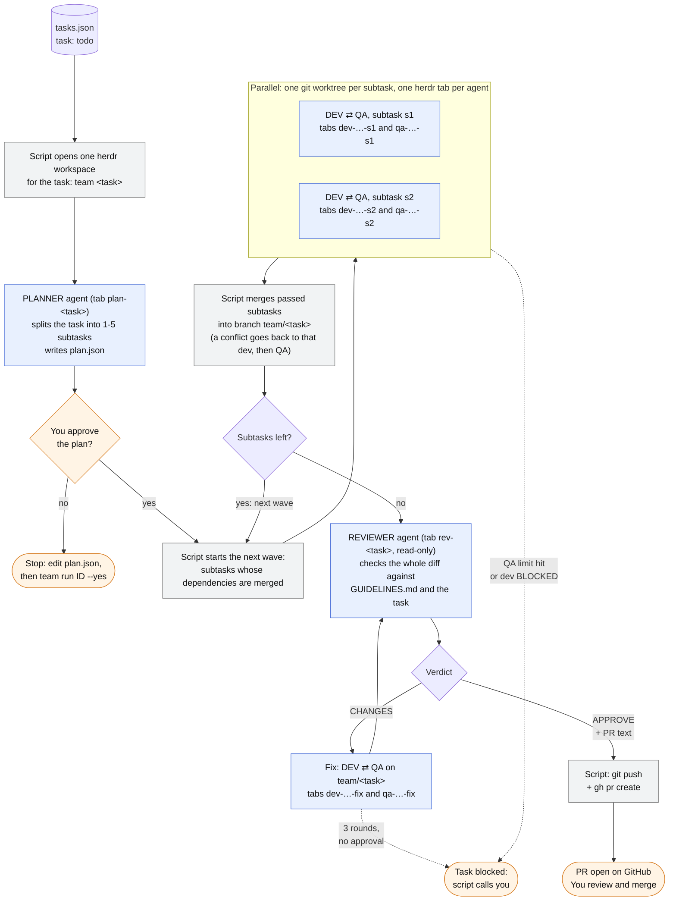

```mermaid
flowchart TD
    board[("tasks.json<br/>task: todo")] --> ws["Script opens one herdr workspace<br/>for the task: team &lt;task&gt;"]
    ws --> planner["PLANNER agent (tab plan-&lt;task&gt;)<br/>splits the task into 1-5 subtasks<br/>writes plan.json"]
    planner --> approve{"You approve<br/>the plan?"}
    approve -- "no" --> edit(["Stop: edit plan.json,<br/>then team run ID --yes"])
    approve -- yes --> wave["Script starts the next wave:<br/>subtasks whose dependencies are merged"]

    subgraph parallel ["Parallel: one git worktree per subtask, one herdr tab per agent"]
        direction LR
        loop1["DEV ⇄ QA, subtask s1<br/>tabs dev-…-s1 and qa-…-s1"]
        loop2["DEV ⇄ QA, subtask s2<br/>tabs dev-…-s2 and qa-…-s2"]
    end
    wave --> parallel
    parallel --> merge["Script merges passed subtasks<br/>into branch team/&lt;task&gt;<br/>(a conflict goes back to that dev, then QA)"]
    merge --> more{"Subtasks left?"}
    more -- "yes: next wave" --> wave
    more -- no --> reviewer["REVIEWER agent (tab rev-&lt;task&gt;, read-only)<br/>checks the whole diff against<br/>GUIDELINES.md and the task"]
    reviewer --> verdict{"Verdict"}
    verdict -- "CHANGES" --> fix["Fix: DEV ⇄ QA on team/&lt;task&gt;<br/>tabs dev-…-fix and qa-…-fix"]
    fix --> reviewer
    verdict -- "APPROVE<br/>+ PR text" --> pr["Script: git push<br/>+ gh pr create"]
    pr --> done(["PR open on GitHub<br/>You review and merge"])

    parallel -. "QA limit hit<br/>or dev BLOCKED" .-> human(["Task blocked:<br/>script calls you"])
    fix -. "3 rounds,<br/>no approval" .-> human

    classDef agent fill:#e8f0fe,stroke:#4a6fd8,color:#111
    classDef script fill:#f1f3f4,stroke:#777,color:#111
    classDef you fill:#fff4e5,stroke:#d9822b,color:#111
    class planner,reviewer,loop1,loop2,fix agent
    class ws,wave,merge,pr script
    class approve,edit,done,human you
```
