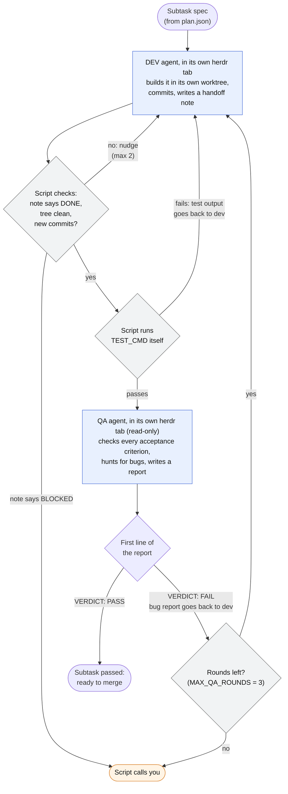

```mermaid
flowchart TD
    start(["Subtask spec<br/>(from plan.json)"]) --> dev["DEV agent, in its own herdr tab<br/>builds it in its own worktree,<br/>commits, writes a handoff note"]
    dev --> chk{"Script checks:<br/>note says DONE,<br/>tree clean,<br/>new commits?"}
    chk -- "no: nudge<br/>(max 2)" --> dev
    chk -- "note says BLOCKED" --> human(["Script calls you"])
    chk -- yes --> gate{"Script runs<br/>TEST_CMD itself"}
    gate -- "fails: test output<br/>goes back to dev" --> dev
    gate -- passes --> qa["QA agent, in its own herdr tab (read-only)<br/>checks every acceptance criterion,<br/>hunts for bugs, writes a report"]
    qa --> verdict{"First line of<br/>the report"}
    verdict -- "VERDICT: FAIL<br/>bug report goes back to dev" --> rounds{"Rounds left?<br/>(MAX_QA_ROUNDS = 3)"}
    rounds -- yes --> dev
    rounds -- no --> human
    verdict -- "VERDICT: PASS" --> out(["Subtask passed:<br/>ready to merge"])

    classDef agent fill:#e8f0fe,stroke:#4a6fd8,color:#111
    classDef script fill:#f1f3f4,stroke:#777,color:#111
    classDef you fill:#fff4e5,stroke:#d9822b,color:#111
    class dev,qa agent
    class chk,gate,rounds script
    class human you
```
