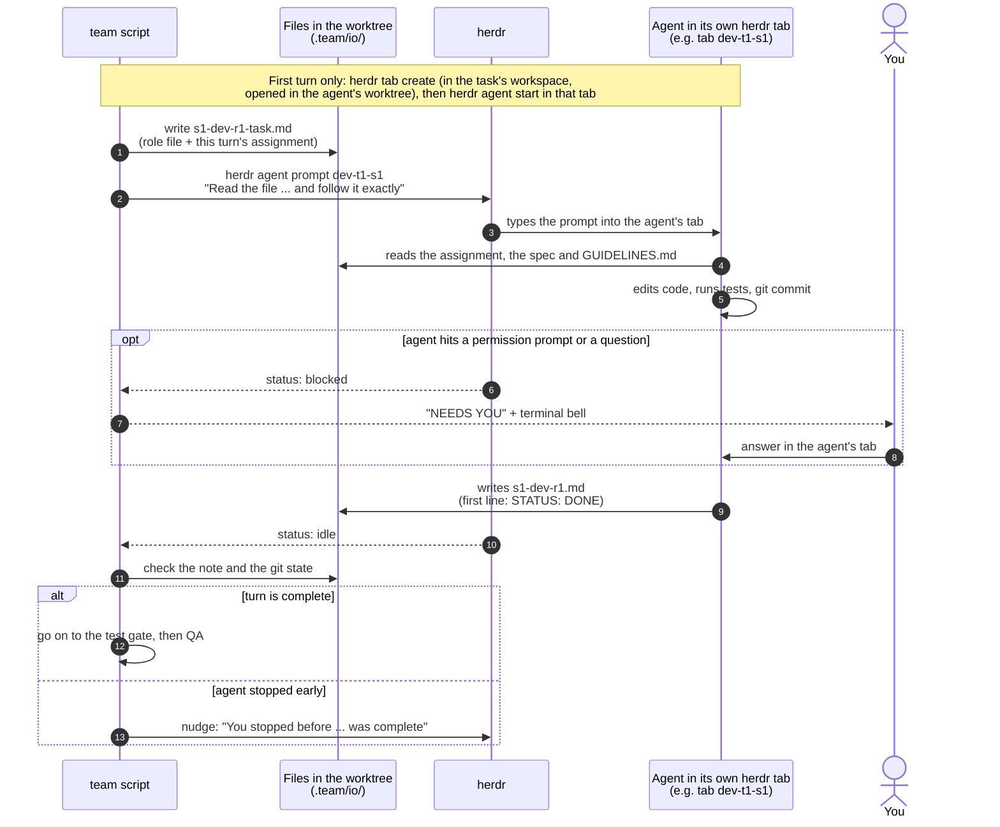

```mermaid
sequenceDiagram
    autonumber
    participant S as team script
    participant F as Files in the worktree<br/>(.team/io/)
    participant H as herdr
    participant A as Agent in its own herdr tab<br/>(e.g. tab dev-t1-s1)
    actor U as You

    Note over S,A: First turn only: herdr tab create (in the task's workspace,<br/>opened in the agent's worktree), then herdr agent start in that tab
    S->>F: write s1-dev-r1-task.md<br/>(role file + this turn's assignment)
    S->>H: herdr agent prompt dev-t1-s1<br/>"Read the file ... and follow it exactly"
    H->>A: types the prompt into the agent's tab
    A->>F: reads the assignment, the spec and GUIDELINES.md
    A->>A: edits code, runs tests, git commit
    opt agent hits a permission prompt or a question
        H-->>S: status: blocked
        S-->>U: "NEEDS YOU" + terminal bell
        U->>A: answer in the agent's tab
    end
    A->>F: writes s1-dev-r1.md<br/>(first line: STATUS: DONE)
    H-->>S: status: idle
    S->>F: check the note and the git state
    alt turn is complete
        S->>S: go on to the test gate, then QA
    else agent stopped early
        S->>H: nudge: "You stopped before ... was complete"
    end
```
